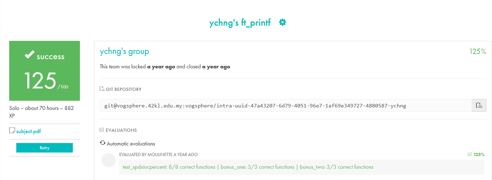

# ft_printf - 42KL ✨

## 💡About The Project

Welcome to my `ft_printf` project! It's my simplified version of `printf` in C, based on the [**project guidelines**](docs/en.subject.pdf).
The goal here is to learn about **variadic arguments** and **formatted output**.

- - -

<!-- ## 🎯 Why I Did It -->
## 🤔 Why I Did It

I wanted to understand how `printf` works in C. It's a function we use all the time, but I was curious to know what's going on under the hood.
***And although it's part of the 42KL curriculum, I'm happy that I completed it***. I learned a lot and had fun exploring these new concepts, working with my friends along the way.

- - -

## 🎉 Project Overview

`ft_printf` supports basic formatting options and handles variadic arguments,
with support for conversion specifiers such as `%c`, `%s`, `%p`, `%d`, `%i`, `%u`, `%x`, `%X`, and `%%`.

<br />

Example:

```c
ft_printf("Hello, %s! You have %d new messages.\n", "Max", 5);
```

Output:

```bash
Hello, Max! You have 5 new messages.
```

- - -

## 🚀 Getting Started

Here's how you can get `ft_printf` up and running on your machine:

<br />

1. **Clone the repository**

```bash
git clone git@github.com:sillymax/ft_printf.git
cd ft_printf
```

<hr />
<br />

2. **Build the project**

> \> _Running `make` will compile the project and create a `lftprintf.a` library._

```bash
make
```

<hr />
<br />

3. **Link the library**

> \> _To use the `lftprintf.a` library in your code, include it's header:_

```c
#include "ft_printf.h"
```

<br />

> \> _When compiling your code, add the required flags to link the `lftprintf.a` library:_

```bash
-I path/to/ft_printf.h -L path/to/libftprintf.a -lftprintf
```

- - -

## 🧪 Run Test

To run the tests for `ft_printf`, use the following command:

```bash
make test
```

- - -

## 🐞 Known Issues and Bugs

- **Limited Format Specifiers:** `ft_printf` does not support all the format specifiers of the standard `printf`.
- **Edge Cases:** Certain edge cases may not be handled perfectly.

- - -

## 📷 Project Result




